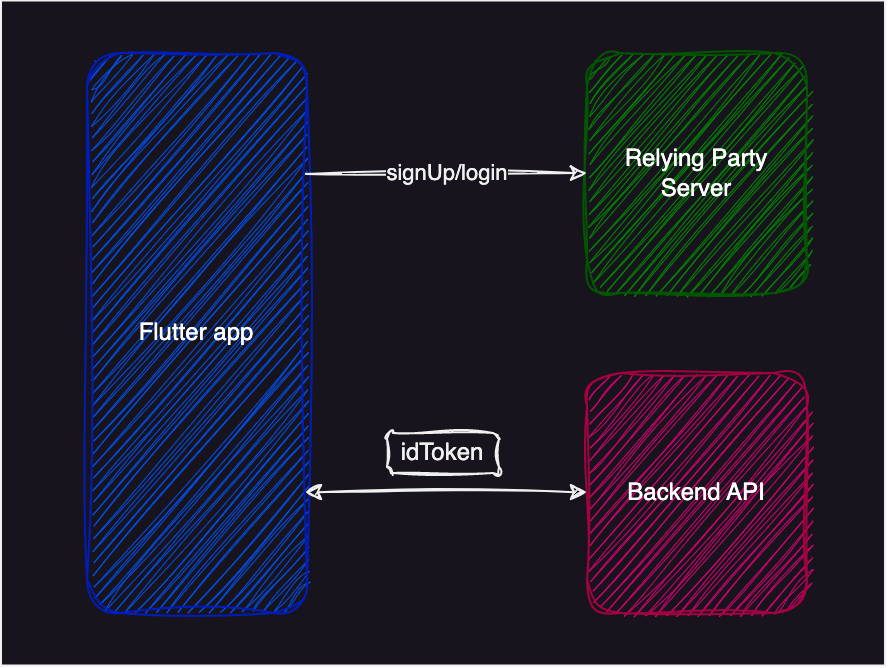

# Complete passkeys integration example for Corbado with Flutter

This is a fully functioning Flutter app that builds on [corbado_auth](https://pub.dev/packages/corbado_auth) to offer passkey authentication on Android and iOS. 
But this is not just a random sample application, this is Corbado's native app for the developer panel.
Is is available on Google Play (with AppStore coming soon), so feel free to try it out by downloading it.

Our goal with this repository is to give you a good understanding about how this app's authentication works and how you could build your own.

## Architecture
The following picture shows the three important parts of our system:

### Flutter app
This is our app. 
It will allow users to sign up and log in and to view all their account's data, i.e. they can view and manage their Corbado projects.

### Relying Party Server (in our case this is corbado.com)
As we want to allow users to log in using passkeys we need a relying party server.
It is responsible for keeping the public keys of all user passkeys and it emits and validates challenges when users want to log in using a passkey.
We are using Corbado as a relying party server including Corbado's session management. 
This means that after a user has successfully logged in the relying party server will return two things:
- an IdToken (JWT): contains user basic information and can be used to make authenticated calls against the Backend API
- a refreshToken: the IdToken has only a short lifetime (in our case 5 minutes) and must be refreshed regularly => this is done using the refreshToken 

### The Developer Panel Backend API
This API exposes all the data that is going to be consumed by the app.
It's endpoints are only available to authenticated users.
Therefore every request needs to have the IdToken set as an Authorization header.
As this repository contains only the code of the Flutter app we will not dig deeper into how the backend exactly works here.
The only noticeable thing is that it must validate and verify the IdToken. 

## Code structure

Now that we know the basic components of our system we take a closer look into the actual Flutter code.
For routing, we use *go_router*.
For state management, wen use *riverpod*.
For authentication, we use *corbado_auth*.

As you can see in the code the basic structure of /lib looks like this:
- models: just some model classes => nothing special here
- providers: here we define all the providers (if you are familiar with riverpod there shouldn't be anything new for you here)
- screens: for every screen in the app we have a file here
- services: here we define the core logic of the app, including AuthService, ProjectService and UserService (we take a closer look at them below)
- widgets: contains the basic building blocks of our app (e.g. buttons, inputs, ...)

### Deep dive into AuthService
AuthService contains all the authentication related logic.
In our app we want to allow users to sign up and log in using passkeys.
To provide a recovery option, every user has to validate his email address first though.
We do this because we don't want users to lose access to their account.

#### Signup
So we first use *signUpEmailInit* to create an email OTP challenge for a user when he signs up.
To complete this challenge, we use *signUpEmailComplete*. 
Now we forward the user to the *append_passkey_screen* to give him to option to create a passkey right away.
When a users chooses to do so, we use *appendPasskey* to append a passkey.

Now the user is logged in to the app. 
Note that all of these functions from the AuthService just wrap functions from *corbado_auth*.
They just add a little bit of error handling (i.e. we define the error messages that we want to show to a user).

#### Login
When a user already has a Corbado account he can directly log in.
When he provides his email address we try to log him in using a passkey by calling *signIn*.
If he has a passkey and completes the passkey ceremony he will be logged in. 
If he doesn't have a passkey (*NoPasskeyForDeviceException*) we will instead send him an email OTP challenge using *signInWithEmailCode*.
After completing that one he will also be logged in.

Now we are almost done with the login part but there is one more thing: Conditional UI.
If you are familiar with passkeys you might have heard of it already.
This is an optimization that makes it even easier for users to log in because it saves them from typing in their email address or user name.
Conditional UI needs to be initialized by calling *initAutoFillSignIn* when the sign_in_screen is loaded.
This function returns a *SignInHandler* that can be completed when the user clicks the text input where he would type in his email.
As soon as this happens the passkey ceremony is started and the user can provide his biometrics to log in.

## How to continue from here

This is a basic sample application that shows how passkeys can be integrated in a Flutter app using Corbado.
Maybe it helped you to get a few ideas about how you can build your own app using passkey authentication.

This repository will be continuously updated and improved (we plan to add more comments to the code).
If you have questions, feedback or wishes regarding features, please reach out to us via [email](mailto:contact@corbado.com) or join our passkeys community on [Slack](https://join.slack.com/t/corbado/shared_invite/zt-1b7867yz8-V~Xr~ngmSGbt7IA~g16ZsQ). 
We are existed about what you are going to build.

We're also happy to receive issues or pull requests if you have suggestions for improvement.
